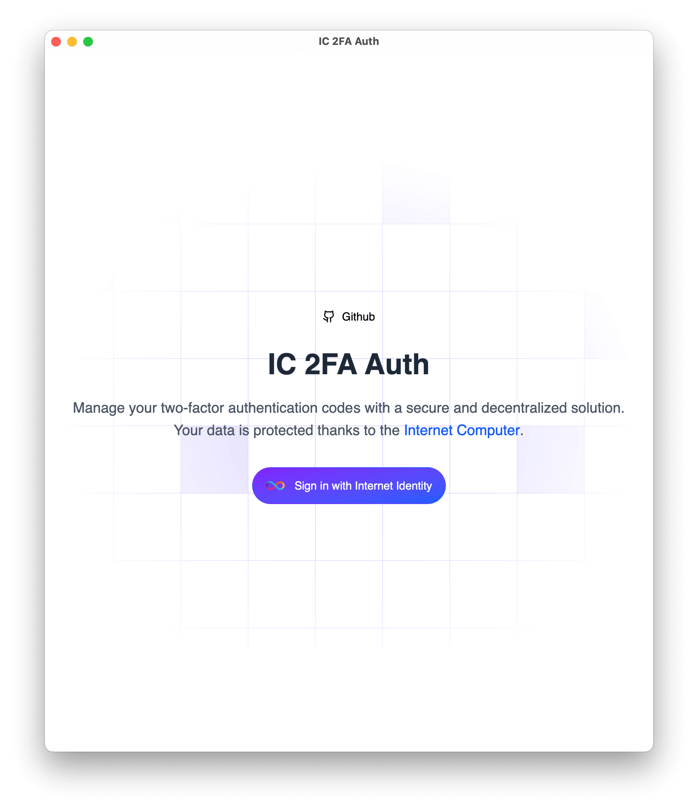
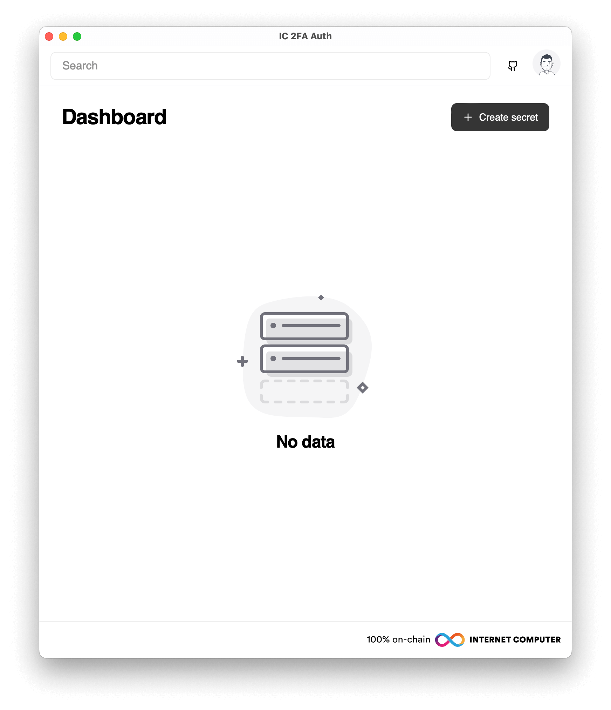
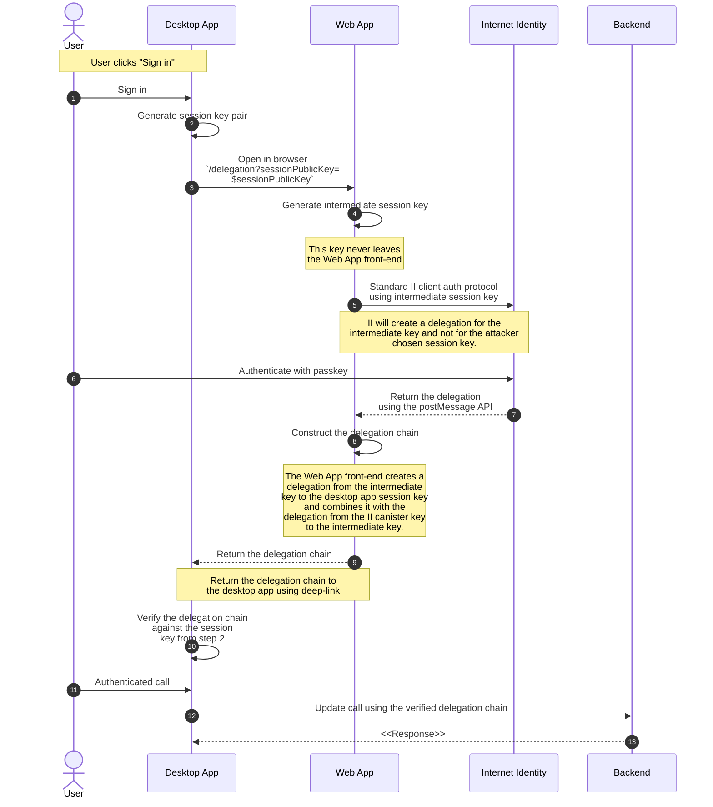

# IC 2FA Auth


Manage your two-factor authentication codes with a secure and decentralized solution powered by the [Internet Computer](https://internetcomputer.org/).




### Deployed Canisters

Backend: [`migky-fiaaa-aaaap-anwya-cai`](https://dashboard.internetcomputer.org/canister/migky-fiaaa-aaaap-anwya-cai)

Frontend: `mphmm-iqaaa-aaaap-anwyq-cai`

🔗 **[Launch App](https://mphmm-iqaaa-aaaap-anwyq-cai.icp0.io/)**

---

## Authentication in Desktop App

User authentication in a desktop application is more complex than standard in-browser authentication. The flow below is based on [this guide](https://internetcomputer.org/docs/building-apps/security/iam#integrating-internet-identity-on-mobile-devices), which describes a delegation-based approach for mobile and desktop integration using Internet Identity.

This implementation follows a more secure delegation pattern as recommended in [Recommendation 6](https://internetcomputer.org/docs/building-apps/security/iam#recommendation-6), where an intermediate identity is created during the authentication process via the web version (shown as a "secure proxy app" in the diagram below).



## Local Development

To run this project locally, you'll need the following tools installed:

* [Docker](https://www.docker.com/)
* [Node.js](https://nodejs.org/en/download)
* [Rust](https://www.rust-lang.org/tools/install)

Start the project with:

```bash
docker compose up
```

During initialization, the script installs all dependencies, builds the Internet Identity, backend, and frontend canisters. A [Caddy](https://caddyserver.com/)-powered local HTTPS server is used. You'll need to generate and trust a local root certificate.

On macOS, run the following to install the [Caddy CA](https://caddyserver.com/docs/automatic-https#local-https) certificate:

```bash
npm run install:ca
```

Once running, Internet Identity will be available at:
**`https://rdmx6-jaaaa-aaaaa-aaadq-cai.localhost/`**
Other canisters will be available at `https://<canister-id>.localhost`.

---

## Development Modes

In addition to the standard `development` and `production` modes, the project includes a third mode: `staging`. Here’s an overview:

### Development

To run the standard web version in development:

```bash
npm run start
```

To run the desktop version in development (Tauri):

```bash
npm run tauri dev
```

This uses browser-based authentication via a frontend proxy and deep linking to return control to the desktop app. Note that macOS (and iOS/Android) does not support runtime deep link registration, which may complicate testing authentication. On Windows/Linux, this should work as expected.

### Staging

Think of this as your application’s `testnet`. Every time you want to preview changes, you deploy to staging. Angular uses `src/environments/environment.staging.ts` for build-time config.

Update the frontend canister build script in [`dfx.json`](https://github.com/faragly/ic-2fa-auth/blob/main/dfx.json#L14):

```diff
"ic-2fa-auth-frontend": {
  "dependencies": ["ic-2fa-auth-backend"],
  "source": ["dist/ic-2fa-auth/browser"],
  "type": "assets",
- "build": ["npm run build"]
+ "build": ["npm run build:staging"]
},
```

Then deploy:

```bash
docker compose exec backend dfx deploy ic-2fa-auth-frontend
```

To build the Tauri desktop app in staging mode:

```bash
npm run tauri:build:staging
```

To enable [WebView Console](https://v2.tauri.app/develop/debug/#webview-console), modify [`src-tauri/Cargo.toml`](https://github.com/faragly/ic-2fa-auth/blob/main/src-tauri/Cargo.toml#L18):

```diff
[dependencies]
-tauri = { version = "2.2.5", features = [] }
+tauri = { version = "2.2.5", features = ["devtools"] }
```

Or install the [CrabNebula DevTools](https://v2.tauri.app/develop/debug/crabnebula-devtools/) plugin.

---

## Cleanup

After you're done, shut down the development environment:

```bash
docker compose down
```

## Acknowledgements

* [Dfinity Foundation](https://dfinity.org/) for [Internet Computer](https://internetcomputer.org/), [Motoko](https://internetcomputer.org/docs/motoko/main/getting-started/motoko-introduction), and 👽 tech
* [Mops](https://mops.one/), [ZhenyaUsenko](https://github.com/ZhenyaUsenko) for [motoko-hash-map](https://github.com/ZhenyaUsenko/motoko-hash-map), [sea-snake](https://forum.dfinity.org/u/sea-snake/summary) for [the post](https://forum.dfinity.org/t/tauri-use-to-dapp-cannot-open-stoic-wallet-and-ii/21683/4?u=rabbithole)
* [Angular](https://angular.dev/), [Tailwind CSS](https://tailwindcss.com/), and community projects like [spartan-ng](https://spartan.ng/), [ngxtension](https://ngxtension.netlify.app/)
* [Tauri](https://v2.tauri.app/) and especially [FabianLars](https://github.com/FabianLars) for plugin development
